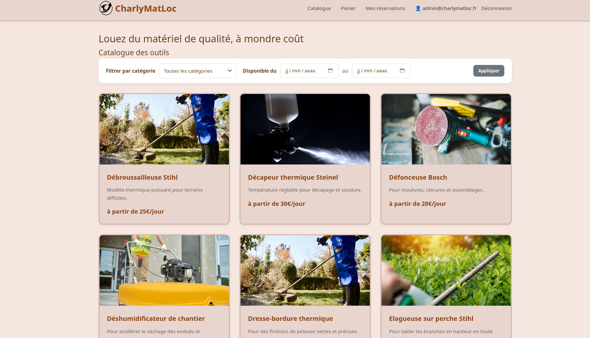
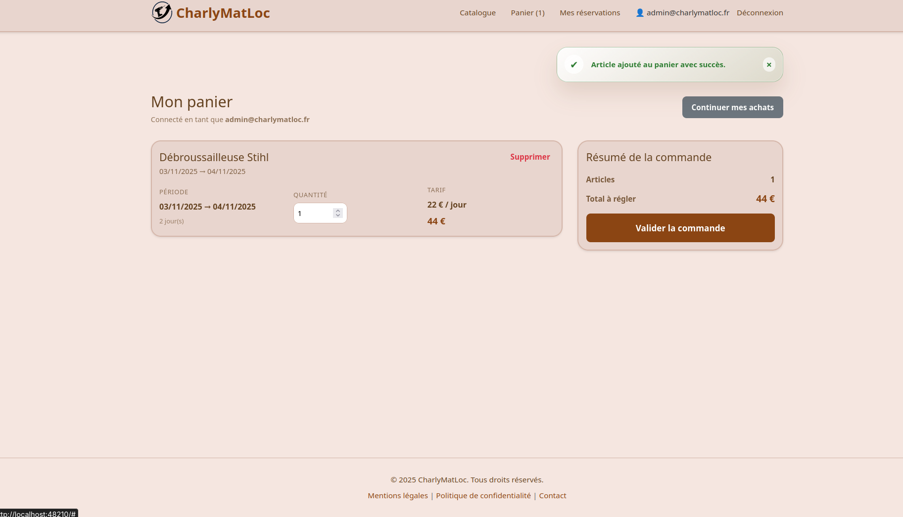
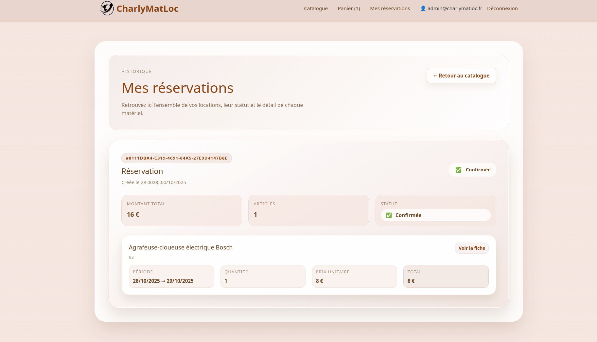

# CharlyMatLoc – Plateforme de location d'outillage

CharlyMatLoc est une application web qui permet de consulter un catalogue d’outils, de filtrer les disponibilités, de gérer un panier et de réserver du matériel. Le projet est découpé entre un frontend Node/Express servant une interface Handlebars et une API REST PHP (Slim) branchée sur une base PostgreSQL. L’ensemble est orchestré par Docker pour fournir un environnement de développement reproductible.

---

## Architecture
- **Frontend** : Express 4 + Handlebars pour le rendu, JavaScript vanilla pour la logique métier (authentification JWT, catalogue, panier, réservations) et Sass pour le style.
- **Backend API** : PHP 8.2, Slim 4, conteneur DI, JWT pour l’authentification, validation Respect\Validation et logs Monolog.
- **Base de données** : PostgreSQL + scripts SQL de création/initialisation (`sql/`).
- **Outils de dev** : Docker Compose (API, front, Postgres, Adminer), PHPUnit & PHPStan, scripts npm pour Sass et serveur de dev.

---

## Prérequis
- Docker & Docker Compose (recommandé pour un démarrage rapide)
- Ou bien : Node.js ≥ 18 et npm, PHP ≥ 8.2 avec l’extension PDO, Composer, PostgreSQL

---

## Fonctionnalités clés

**Itération 1 – Catalogue & panier initial**
- Affichage du catalogue d’outils (nom, visuel, disponibilité).
- Fiche détail avec description, catégorie et tarif.
- Sélection d’un outil pour une journée et ajout au panier.
- Visualisation du panier et calcul du montant total.

**Itération 2 – Comptes & réservations**
- Inscription et authentification des utilisateurs.
- Gestion du panier persistante pour chaque utilisateur connecté.
- Historique des réservations via la section « Mes réservations ».

**Itération 3 – Réservation multi-jours**
- Réservation d’un outil sur plusieurs jours avec vérification de disponibilité.

**Itération 4 – Multi-exemplaires**
- Gestion d’inventaires multiples par outil avec validation des quantités demandées.

**Fonctionnalités étendues**
- Pagination et filtrage du catalogue.
- Panier persistant tant que le paiement n’est pas validé.
- Modification du panier (suppression, ajustement des quantités).
- Simulation de paiement en fin de parcours.

### Références de code par fonctionnalité

| Fonctionnalité | Frontend | Backend / Données |
| --- | --- | --- |
| Catalogue d’outils (itération 1) | `front.charlyMatLoc/src/js/main.js:329`<br>`front.charlyMatLoc/src/templates/catalog.hbs:1` | `back.charlyMatLoc/app/src/api/actions/GetCatalogAction.php:24`<br>`back.charlyMatLoc/app/src/application_core/application/usecases/ServiceTool.php:25` |
| Fiche détail outil (itération 1) | `front.charlyMatLoc/src/js/main.js:1051`<br>`front.charlyMatLoc/src/templates/tool-detail.hbs:1` | `back.charlyMatLoc/app/src/api/actions/GetToolByIdAction.php:24`<br>`back.charlyMatLoc/app/src/application_core/application/usecases/ServiceTool.php:41` |
| Sélection & ajout au panier (itération 1) | `front.charlyMatLoc/src/js/main.js:623`<br>`front.charlyMatLoc/src/templates/tool-detail.hbs:52` | `back.charlyMatLoc/app/src/api/actions/AddToCartAction.php:23`<br>`back.charlyMatLoc/app/src/application_core/application/usecases/ServiceCart.php:30` |
| Vue panier & total (itération 1) | `front.charlyMatLoc/src/templates/card.hbs:1`<br>`front.charlyMatLoc/src/js/main.js:733` | `back.charlyMatLoc/app/src/api/actions/GetCartDetailsAction.php:21`<br>`back.charlyMatLoc/app/src/infrastructure/repositories/PDOCartRepository.php:23` |
| Inscription (itération 2) | `front.charlyMatLoc/src/js/main.js:576`<br>`front.charlyMatLoc/src/templates/register.hbs:1` | `back.charlyMatLoc/app/src/api/actions/RegisterAction.php:27`<br>`back.charlyMatLoc/app/src/application_core/ports/api/service/CharlymatlocAuthnService.php:40` |
| Authentification (itération 2) | `front.charlyMatLoc/src/js/main.js:559`<br>`front.charlyMatLoc/src/templates/login.hbs:1` | `back.charlyMatLoc/app/src/api/actions/SigninAction.php:21`<br>`back.charlyMatLoc/app/src/application_core/ports/api/service/CharlymatlocAuthnService.php:21` |
| Panier de l’utilisateur connecté (itération 2) | `front.charlyMatLoc/src/js/main.js:374` | `back.charlyMatLoc/app/src/api/actions/GetCartDetailsAction.php:21`<br>`back.charlyMatLoc/app/src/infrastructure/repositories/PDOCartRepository.php:87` |
| Mes réservations (itération 2) | `front.charlyMatLoc/src/js/main.js:405`<br>`front.charlyMatLoc/src/templates/reservations.hbs:1` | `back.charlyMatLoc/app/src/api/actions/GetReservationsAction.php:22`<br>`back.charlyMatLoc/app/src/application_core/application/usecases/ServiceReservation.php:27` |
| Réservation multi-jours (itération 3) | `front.charlyMatLoc/src/templates/tool-detail.hbs:53`<br>`front.charlyMatLoc/src/js/main.js:623` | `back.charlyMatLoc/app/src/application_core/application/usecases/ServiceCart.php:37`<br>`back.charlyMatLoc/app/src/infrastructure/repositories/PDOToolRepository.php:128` |
| Multi-exemplaires par outil (itération 4) | `front.charlyMatLoc/src/templates/tool-detail.hbs:77`<br>`front.charlyMatLoc/src/js/main.js:733` | `back.charlyMatLoc/app/src/application_core/application/usecases/ServiceCart.php:172`<br>`back.charlyMatLoc/app/src/infrastructure/repositories/PDOToolRepository.php:128` |
| Pagination & filtres catalogue | `front.charlyMatLoc/src/js/main.js:503`<br>`front.charlyMatLoc/src/templates/catalog.hbs:6` | `back.charlyMatLoc/app/src/api/actions/GetCatalogAction.php:24`<br>`back.charlyMatLoc/app/src/application_core/application/usecases/ServiceTool.php:63` |
| Panier persistant (avant paiement) | `front.charlyMatLoc/src/js/main.js:374` | `back.charlyMatLoc/app/src/application_core/application/usecases/ServiceCart.php:67`<br>`back.charlyMatLoc/app/src/infrastructure/repositories/PDOCartRepository.php:226`<br>`sql/4carts.schema.sql:5` |
| Modification du panier | `front.charlyMatLoc/src/js/main.js:700`<br>`front.charlyMatLoc/src/js/main.js:733` | `back.charlyMatLoc/app/src/api/actions/RemoveFromCartAction.php:23`<br>`back.charlyMatLoc/app/src/api/actions/UpdateCartItemQuantityAction.php:20` |
| Paiement simulé & confirmation | `front.charlyMatLoc/src/js/main.js:792` | `back.charlyMatLoc/app/src/api/actions/ProcessPaymentAction.php:22`<br>`back.charlyMatLoc/app/src/application_core/application/usecases/ServicePayment.php:27`<br>`sql/6payments.shema.sql:3` |

---

## Aperçu de l’interface





---

## Démarrage rapide (Docker Compose)
1. **Cloner le dépôt**
   ```bash
   git clone <repo-url>
   cd SaeCharlyMatLoc
   ```
2. **Configurer l’API**  
   Copier le fichier d’exemple si besoin et ajuster les valeurs :
   ```bash
   cp back.charlyMatLoc/app/config/.env.dist back.charlyMatLoc/app/config/.env
   ```
3. **Lancer les services**
   ```bash
   docker compose up --build
   ```
4. **Accéder aux applications**
   - Frontend : http://localhost:48210  
   - API REST : http://localhost:48211  
   - PostgreSQL : port 48212 (user/pass/db `charlymatloc`)  
   - Adminer : http://localhost:48213 pour explorer la base

Les scripts dans `sql/` sont automatiquement appliqués lors du premier lancement pour créer le schéma et injecter des données de démonstration.

Pour arrêter les services : `docker compose down`.

---

## Installation manuelle (sans Docker)

### Backend (API Slim)
```bash
cd back.charlyMatLoc/app
composer install
cp config/.env.dist config/.env   # puis adapter les valeurs si nécessaire
php -S 0.0.0.0:8000 -t public
```

### Frontend (Express + Sass)
```bash
cd front.charlyMatLoc
npm install
npm run sass:build      # compile les fichiers SCSS -> CSS
npm run dev             # lance le watcher Sass + serveur Express (port 3000)
```

Veillez à mettre à jour `API_BASE_URL` dans `src/js/main.js` si vous utilisez des ports différents de ceux fournis par Docker (valeurs localhost déjà gérées pour 48211).

---

## Variables d’environnement clés

| Fichier | Variable | Description |
| --- | --- | --- |
| `charlyMatLoc.env` | `POSTGRES_DB`, `POSTGRES_USER`, `POSTGRES_PASSWORD` | Identifiants Postgres utilisés par Docker |
| `back.charlyMatLoc/app/config/.env` | `DISPLAY_ERROR_DETAILS` | Active l’affichage détaillé des erreurs (à désactiver en prod) |
|  | `JWT_SECRET`, `JWT_ISSUER`, `JWT_ALGORITHM`, `JWT_ACCESS_DURATION`, `JWT_REFRESH_DURATION` | Paramètres de génération des tokens JWT |

---

## Données de démonstration
- Le jeu de données d’init est dans `sql/*.data.sql`.
- Comptes par défaut :
  - Client : `client@charlymatloc.fr` / `Client123!`
  - Admin : `admin@charlymatloc.fr` / `Admin456!`

---

## Principales routes API

| Méthode | Route | Description | Auth |
| --- | --- | --- | --- |
| `POST` | `/auth/signin` | Connexion, renvoie un JWT et le profil utilisateur | Public |
| `POST` | `/auth/signup` | Inscription d’un nouveau compte | Public |
| `GET` | `/tools` | Catalogue paginé des outils | Public |
| `GET` | `/tools/{id}` | Détails d’un outil | Public |
| `GET` | `/tools/{id}/availability` | Disponibilités d’un outil sur une période | Public |
| `GET` | `/users/{userId}/cart` | Récupération du panier utilisateur | JWT requis |
| `POST` | `/users/{userId}/cart/items` | Ajout d’un outil au panier | JWT requis |
| `PATCH` | `/users/{userId}/cart/items/{itemId}` | Mise à jour de quantité | JWT requis |
| `DELETE` | `/users/{userId}/cart/items/{itemId}` | Suppression d’un item | JWT requis |
| `POST` | `/users/{userId}/reservations` | Création d’une réservation depuis le panier | JWT requis |
| `GET` | `/users/{userId}/reservations` | Historique des réservations | JWT requis |
| `POST` | `/users/{userId}/reservations/{reservationId}/payments` | Simulation de paiement | JWT requis |

Les middlewares `AuthnMiddleware` (authentification) et `AuthzMiddleware` (autorisation) sécurisent les routes utilisateur.

---

## Scripts utiles

| Contexte | Commande | Description |
| --- | --- | --- |
| Frontend | `npm run dev` | Watch Sass + serveur Express (port 3000 ou 48210 via Docker) |
| Frontend | `npm run sass:build` | Compilation ponctuelle des styles |
| Backend | `composer install` | Installation des dépendances PHP |
| Backend | `./vendor/bin/phpunit` | Lancer la suite de tests (si présente) |
| Backend | `./vendor/bin/phpstan analyse` | Analyse statique PHPStan |

---

## Structure du projet
```text
.
├── back.charlyMatLoc/          # API Slim & logique métier (DDD hexagonal)
│   └── app/
│       ├── config/             # Container, routes, settings, .env
│       ├── public/             # Front controller de l’API
│       └── src/                # Core, infrastructure, middlewares, actions
├── front.charlyMatLoc/         # Frontend Express + Handlebars + Sass
│   ├── public/                 # Images/assets statiques
│   └── src/                    # Templates, JS, SCSS, serveur Express
├── sql/                        # Scripts de création & données de démonstration
├── docker-compose.yml          # Stack de développement (front + API + DB + Adminer)
└── README.md
```

---

## Ressources complémentaires
- Cahier des charges et documentation : voir le dossier `Sujets/`.
- Lien Notion du projet : <https://www.notion.so/29276127066580ae9c89d67276761741?source=copy_link>
